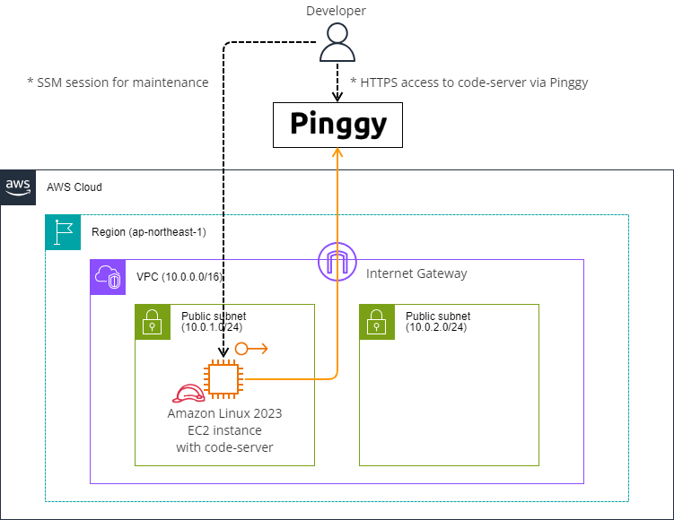
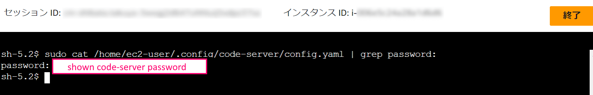
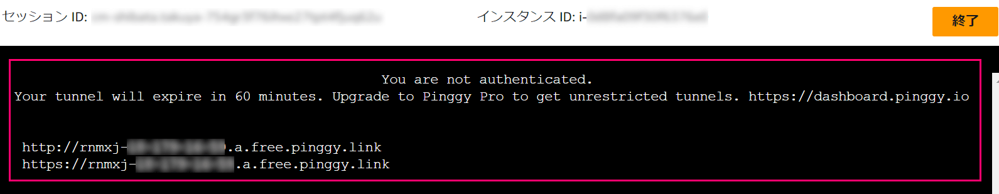
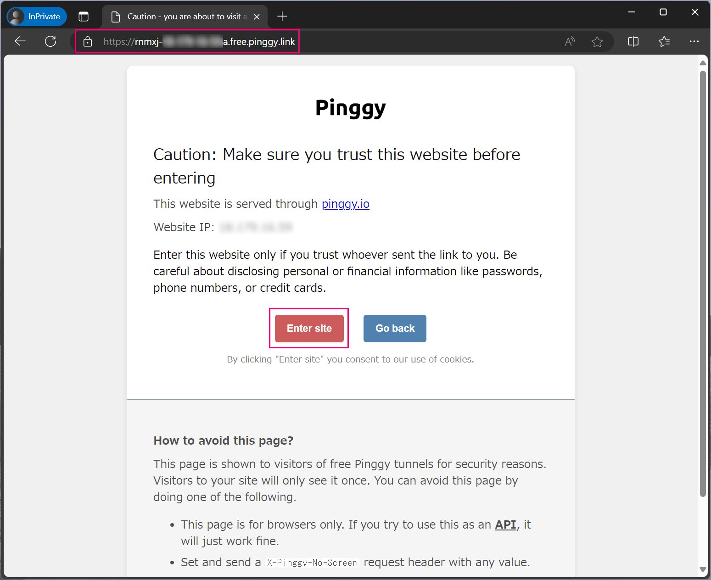
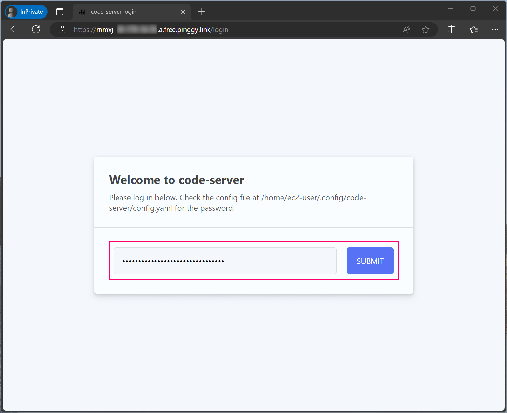
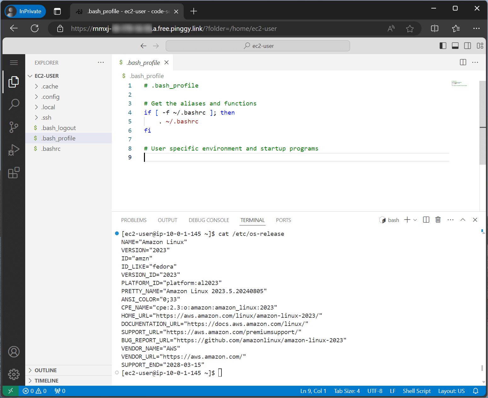

# code-server-cfn with Pinggy

シンプルな`code-server`環境を作るためのCloudFormationテンプレートです。  
本テンプレートではAWS環境の他に`Pinggy`を使いHTTPSアクセスを実現します。  

* [coder/code-server](https://github.com/coder/code-server)
* [Pinggy](https://pinggy.io/)

このテンプレートは[AWS Cloud9](https://aws.amazon.com/cloud9/)の代替を意図して作成しました。  
主な用途として[AWS Workshops](https://workshops.aws/)やコミュニティイベントのハンズオン等での __一時的な__ 利用を想定しています。

> [!WARNING]  
> このテンプレートは永続的な開発環境として使うことを意図していません

永続的な開発環境が必要な場合は[Coder](https://coder.com/)を使用してください。  

* [https://coder.com/](https://coder.com/)

## 作成される環境

本テンプレートは新規にVPCと`code-server`がインストールされた1台のEC2インスタンスを作成します。  



ただし、通常の`code-server-cfn`と異なりセキュリティグループが全てのインバウンド通信を拒否する様になっています。  

このテンプレートでは`Pinggy`を使い一時的な公開URL(無料版だと60分間利用可能)を発行し、そのURLにアクセスすることで`code-server`を使用します。  

以下の環境でテスト済みです。  

* AWS 東京リージョン (ap-northeast-1)
* Amazon Linux 2023 : 2023.5.20240730.0
* code-server : v4.91.1

## 利用方法

VPC、EC2、IAMロールを作成可能な権限を持つユーザーで作業してください。  

東京リージョンでAWS CloudShellを起動し以下のコマンドを実行して環境を構築します。  

```bash
#
# 東京リージョンのAWS CloudShellで以下のコマンドを実行します
# 

# 本リポジトリをclone
git clone https://github.com/stknohg/code-server-cfn.git --depth 1
cd code-server-cfn/

# CloudFormationスタックを作成
aws cloudformation create-stack --stack-name temp-code-server-pinggy \
    --template-body file://./Pinggy/code-server-pinggy.yaml \
    --capabilities CAPABILITY_NAMED_IAM
```

CloudFormationスタックがエラー無く完了すればセットアップは完了です。  

### 2. code-serverパスワードの取得

`code-server`へアクセスする際にパスワードが必要になります。  

このパスワードはEC2インスタンスのOS内部に保存されており、SSM Sessionでインスタンス内部に接続してから次のコマンドを実行して取得してください。  

```bash
#
# SSM Sessionを使いEC2インスタンスに接続して次のコマンドを実行します
#

# code-serverのパスワードを取得
sudo cat /home/ec2-user/.config/code-server/config.yaml | grep password:
```



このパスワードは後で使用します。  

### 3. Pinggyの起動 + code-serverへのアクセス

続けて以下のコマンドを実行してPinggyの一時URLを発行します。 

```bash
#
# SSM Sessionを使いEC2インスタンスに接続して次のコマンドを実行します
#

ssh -p 443 -R0:localhost:8080 a.pinggy.io
```

初回実行時はホストキーの確認が出るので`yes`を入力して処理を続行してください。  

> The authenticity of host '[a.pinggy.io]:443 ([xx.xx.xx.xx]:443)' can't be established.  
> RSA key fingerprint is SHA256:xxxxxxxxxxxxxxxxxx/xxxxxxxxxxxxxxxxxxxxxxx.  
> This key is not known by any other names  
> Are you sure you want to continue connecting (yes/no/[fingerprint])?  

最終的に下図の形になればOKです。  
SSM Sessionはこのままの状態にしておきます。  



次にブラウザから発行された一時URL`https://<ランダムな文字列>.a.free.pinggy.link`にアクセスし、「Enter site」をクリックします。  



`code-server`のログイン画面に遷移するので、先ほど取得したパスワードを入力し「SUBMIT」ボタンをクリックします。  



初期設定を済ませて後は自由にWeb IDEを利用してください。



### 4. 終了

Web IDEの利用を終えた後はEC2インスタンスを停止し、CloudFormationスタックを削除して環境を削除します。  

東京リージョンでAWS CloudShellを起動し以下のコマンドを実行すると環境を削除できます。  

```bash
#
# 東京リージョンのAWS CloudShellで以下のコマンドを実行します
# 

# CloudFormationスタックの削除
aws cloudformation delete-stack --stack-name temp-code-server-pinggy
```
