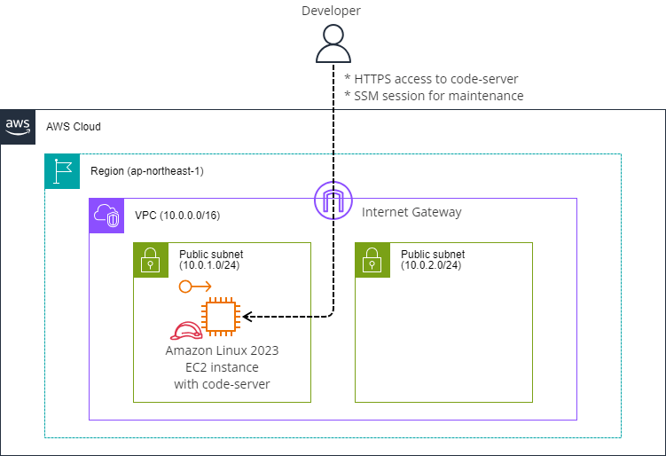

# code-server-cfn

シンプルな`code-server`環境を作るためのCloudFormationテンプレートです。  

* [coder/code-server](https://github.com/coder/code-server)

このテンプレートは[AWS Cloud9](https://aws.amazon.com/cloud9/)の代替を意図して作成しました。  
主な用途として[AWS Workshops](https://workshops.aws/)やコミュニティイベントのハンズオン等での __一時的な__ 利用を想定しています。

> [!WARNING]  
> このテンプレートは永続的な開発環境として使うことを意図していません

永続的な開発環境が必要な場合は[Coder](https://coder.com/)を使用してください。  

* [https://coder.com/](https://coder.com/)

## 作成される環境

本テンプレートは新規にVPCと`code-server`がインストールされた1台のEC2インスタンスを作成します。  



以下の環境でテスト済みです。  

* AWS 東京リージョン (ap-northeast-1)
* Amazon Linux 2023 : 2023.5.20240730.0
* code-server : v4.91.1

## 利用方法

VPCとEC2を作成可能な権限を持つユーザーで作業してください。  

### 1. 環境構築

はじめにローカル環境で以下のコマンドを実行して、自分のグローバルIPアドレスを取得してください。  
取得したグローバルIPアドレスは次の手順で使います。  

```bash
#
# ローカル環境で次のコマンドを実行します
#

# Widnows環境の場合
curl.exe -s https://checkip.amazonaws.com

# macOSおよびLinux環境の場合
curl -s https://checkip.amazonaws.com
```

次に東京リージョンでAWS CloudShellを起動し以下のコマンドを実行して環境を構築します。  
`YOUR_GLOBAL_IP`変数にご自身のグローバルIPアドレスを設定します。  

```bash
#
# 東京リージョンのAWS CloudShellで以下のコマンドを実行します
# 

# 本リポジトリをclone
git clone https://github.com/stknohg/code-server-cfn.git --depth 1
cd code-server-cfn/

# 自分のグローバルIPアドレスを設定
export YOUR_GLOBAL_IP="XX.XX.XX.XX"

# CloudFormationスタックを作成
aws cloudformation create-stack --stack-name temp-code-server \
    --template-body file://./code-server.yaml \
    --parameters "ParameterKey=UserCIDR,ParameterValue=${YOUR_GLOBAL_IP}/32" \
    --capabilities CAPABILITY_NAMED_IAM
```

CloudFormationスタックがエラー無く完了すればセットアップは完了です。  

### 2. code-serverへのアクセス

`code-server`へアクセスする際にパスワードが必要になります。  

このパスワードはEC2インスタンスのOS内部に保存されており、SSM Sessionでインスタンス内部に接続してから次のコマンドを実行して取得してください。  

```bash
#
# SSM Sessionを使いEC2インスタンスに接続して次のコマンドを実行します
#

# code-serverのパスワードを取得
sudo cat /home/ec2-user/.config/code-server/config.yaml | grep password:
```


続けてWEBブラウザを起動し`https://<Your EC2 instance Public IP>/`にアクセスしてください。  

直接IPアドレスを指定しているので「接続がプライベートでない」旨のエラーがでますがそのまま続行します。  


すると`code-server`のログイン画面に遷移しますので、先ほど取得したパスワードを入力し「SUBMIT」ボタンをクリックします。  


初期設定を済ませて、後は自由にWeb IDEを利用してください。


直接IPアドレスを指定しているため以下のSSLエラーが出ますが、これは意図した挙動ですので無視してください。  

> An SSL certificate error occurred when fetching the script.


> [!WARNING]  
> SSLエラーを解消したい場合は別途適切なサーバー証明書を導入してください。  
> もしくは code-server でなく Coder を使用してください。

### 3. 終了

Web IDEの利用を終えた後はEC2インスタンスを停止し、CloudFormationスタックを削除して環境を削除します。  

東京リージョンでAWS CloudShellを起動し以下のコマンドを実行すると環境を削除できます。  

```bash
#
# 東京リージョンのAWS CloudShellで以下のコマンドを実行します
# 

# CloudFormationスタックの削除
aws cloudformation delete-stack --stack-name temp-code-server
```

## ライセンス

本テンプレートは[MIT License](./LICENSE)で公開しています。  

必要に応じて改変してご利用ください。  
